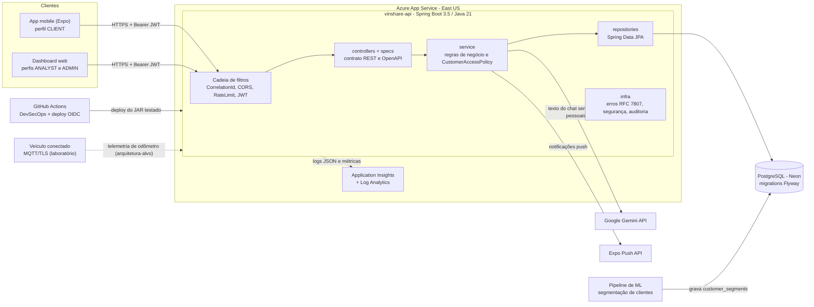
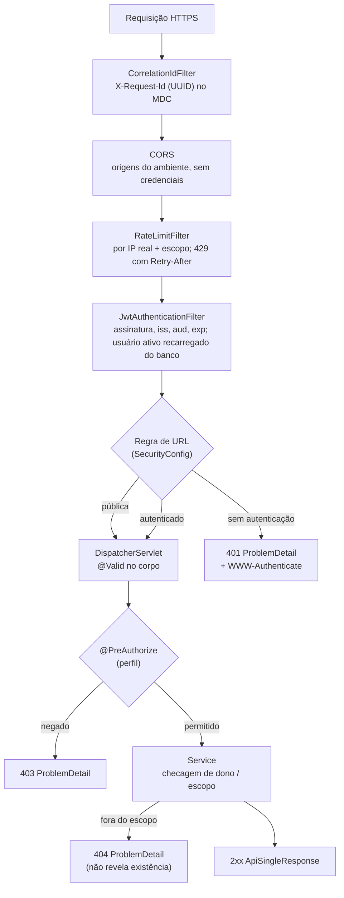
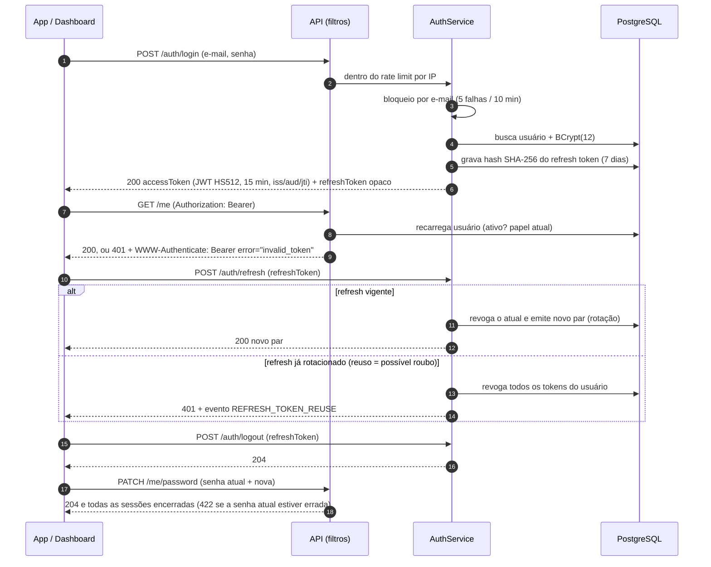

# Arquitetura da solução: Ford VIN Share API

## 1. Contexto

O **VIN Share** é a porcentagem de veículos Ford que fazem manutenção na rede oficial. A solução aumenta esse indicador em três frentes:

- **Cliente (app mobile Expo):** agenda revisões, acompanha garantia e alertas de manutenção, avalia o atendimento (NPS), acumula e resgata pontos, e conversa com um assistente de IA.
- **Concessionária (dashboard web, perfil ANALYST):** trabalha leads de clientes em risco de sair da rede, faz check-in e conclusão de serviços e consulta a visão 360 do cliente.
- **Ford (dashboard web, perfil ADMIN):** acompanha o VIN Share da rede (KPIs, séries e ranking por concessionária) e gerencia o catálogo de prêmios.

A segmentação de risco (FIEL, ECONOMICO, ESQUECIDO, ABANDONO) vem do modelo de Machine Learning e é gravada em `customer_segments`, com `model_version` e `top_features` para explicabilidade.

## 2. Componentes

| Camada / pacote | Responsabilidade | Não pode |
|---|---|---|
| `controllers` | Traduzir HTTP para chamada de serviço, escolher o status (201 + `Location`, 204) e aplicar `@PreAuthorize` | Acessar repositório ou conter regra de negócio |
| `specs` | Contrato OpenAPI (anotações Swagger, `@Valid`) implementado pelos controllers | Ter lógica |
| `service` | Regras de negócio, transações, escopo de dados (`CustomerAccessPolicy`), privacidade (`PrivacyService`) e auditoria | Conhecer HTTP |
| `repositories` | Consultas JPA e SQL nativo parametrizado | Aplicar regra de acesso |
| `domain` | Entidades JPA e DTOs (records) | Expor entidade na resposta HTTP |
| `infra/errors` | `GlobalExceptionHandler`, `ProblemDetails` e `ProblemDetailsWriter` (RFC 7807) | Expor stack trace, SQL ou nome de classe |
| `infra/security` | JWT, rate limit, IP real, bloqueio de força bruta, criptografia de CPF, eventos de segurança, redação de PII | — |

## 3. Caminho de uma requisição

## 4. Fluxo de autenticação

**Informações do token:**
- `sub` = id do usuário;
- `iss` = `ford-vinshare-api`;
- `aud` = `vinshare-clients`;
- `jti` = identificador único;
- `iat` e `exp` = emissão e expiração (15 min);
- `role` = informativo para o cliente.

A **autorização usa o papel gravado no banco**, recarregado a cada requisição. Desativar ou rebaixar um usuário tem efeito imediato, sem esperar o token expirar.

## 5. Perfis e escopo de dados

| Recurso | CLIENT | ANALYST | ADMIN |
|---|---|---|---|
| Próprios veículos, agendamentos, serviços, NPS, fidelidade e chat | ✅ só os dele (outro cliente → 404) | ❌ 403 | ❌ 403 |
| Exportar / excluir a própria conta (LGPD) | ✅ | ❌ | ❌ |
| Trocar a própria senha | ✅ | ✅ | ✅ |
| Check-in e conclusão de serviço | ❌ | ✅ só na própria concessionária (outra → 403) | ❌ 403 (supervisiona, não opera) |
| Leads, segmentos por cliente, visão 360, timeline | ❌ | ✅ só clientes da própria concessionária de relacionamento (outros → 404) | ✅ rede inteira |
| Registrar ação de contato com lead | ❌ | ✅ (escopo) | ❌ 403 |
| KPIs, VIN Share, NPS agregado, distribuição de segmentos | ❌ | ✅ agregados, sem dado pessoal | ✅ |
| Catálogo de prêmios (criar, alterar, desativar) | leitura | leitura | ✅ escrita |
| `/actuator/metrics` | ❌ | ❌ | ✅ |

A **concessionária de relacionamento** (`customers.home_dealership_id`) é a do serviço mais recente do cliente. Se o cliente não tem histórico, ela é definida no primeiro agendamento.

## 6. Endpoints

Base: `/api/v1`. Sucesso sempre no envelope `ApiSingleResponse`; erro sempre `application/problem+json`.

| Método | Path | Sucesso | Perfis |
|---|---|---|---|
| POST | /auth/register | 201 + Location | público |
| POST | /auth/login | 200 | público |
| POST | /auth/refresh | 200 | público |
| POST | /auth/logout | 204 | público (exige o refresh token) |
| GET | /me | 200 | autenticado |
| PATCH | /me/password | 204 (422 senha atual errada, 429 após 5 erros); encerra as demais sessões | autenticado |
| GET | /me/vehicles | 200 | CLIENT |
| GET | /me/services | 200 (paginado) | CLIENT |
| GET | /me/appointments | 200 (paginado) | CLIENT |
| GET | /me/data-export | 200 | CLIENT |
| DELETE | /me | 204 | CLIENT |
| POST | /me/devices | 201 | autenticado |
| DELETE | /me/devices/{token} | 204 | autenticado |
| GET | /me/loyalty/balance | 200 | CLIENT |
| GET | /me/loyalty/transactions | 200 (paginado) | CLIENT |
| POST | /me/loyalty/redeem | 201 | CLIENT |
| GET | /me/surveys/pending | 200 | CLIENT |
| GET | /loyalty/rewards | 200 | autenticado |
| GET | /loyalty/rewards/{id} | 200 | autenticado |
| POST | /loyalty/rewards | 201 + Location | ADMIN |
| PUT | /loyalty/rewards/{id} | 200 | ADMIN |
| DELETE | /loyalty/rewards/{id} | 204 | ADMIN |
| GET | /vehicles/{id}/warranty | 200 | CLIENT (dono) |
| GET | /vehicles/{id}/maintenance-alerts | 200 | CLIENT (dono) |
| PATCH | /vehicles/{id}/odometer | 200 (422 se regredir) | CLIENT (dono) |
| POST | /appointments | 201 + Location (422 no passado, 409 conflito) | CLIENT |
| GET | /appointments/{id} | 200 | CLIENT (dono) |
| PATCH | /appointments/{id}/cancel | 200 (409 se não aberto) | CLIENT (dono) |
| PATCH | /appointments/{id}/check-in | 200 | ANALYST (mesma concessionária) |
| PATCH | /appointments/{id}/complete | 200 | ANALYST (mesma concessionária) |
| GET | /services/{id} | 200 | CLIENT (dono) |
| POST | /services/{id}/nps | 201 + Location | CLIENT (dono) |
| GET | /services/{id}/nps | 200 | CLIENT (dono) |
| GET | /dealerships?lat&lng | 200 | autenticado |
| GET | /dealerships/{id} | 200 | autenticado |
| GET | /dealerships/{id}/availability | 200 | autenticado |
| GET | /service-types | 200 | autenticado |
| POST | /chat/sessions | 201 + Location | autenticado |
| POST | /chat/sessions/{id}/messages | 201 | dono da sessão |
| GET | /chat/sessions/{id}/messages | 200 | dono da sessão |
| GET | /analytics/kpis, /analytics/nps, /analytics/vin-share/series, /analytics/vin-share/by-dealership | 200 | ANALYST, ADMIN |
| GET | /segments/distribution | 200 | ANALYST, ADMIN |
| GET | /segments/{segment}/customers | 200 (paginado) | ANALYST (escopo), ADMIN |
| GET | /customers/{id}/segment, /360, /timeline | 200 | ANALYST (escopo), ADMIN |
| GET | /leads | 200 (paginado, maior risco primeiro) | ANALYST (escopo), ADMIN |
| GET | /leads/{customerId} | 200 | ANALYST (escopo), ADMIN |
| POST | /leads/{customerId}/actions | 201 | ANALYST (escopo) |
| GET | /actuator/health, /actuator/info | 200 | público |
| GET | /actuator/metrics | 200 | ADMIN |
| GET | /docs, /v3/api-docs | 200 | público |

## 7. Decisões de projeto

1. **Transições de estado como sub-recursos** (`/cancel`, `/check-in`, `/complete`, `/redeem`).
   - Esses paths já estão no APK publicado e no dashboard, então foram mantidos.
   - Cada um representa uma transição explícita, com pré-condições próprias: `PATCH` quando muda o estado de um recurso existente, `POST` quando cria outro (resgate → voucher).
   - A evolução prevista para a v2 é `PATCH /appointments/{id}` com `{"status": ...}` e `POST /me/loyalty/redemptions`.
2. **404 e não 403 fora do escopo.** Um cliente ou analista que tenta acessar um objeto alheio recebe 404, para não confirmar que o objeto existe (OWASP API1).
3. **Refresh token opaco e rotacionado.** É guardado só como hash; o reuso de um token antigo derruba a sessão inteira. Sessões encerradas por troca de senha ou anonimização são **apagadas**, não revogadas, para não disparar alarmes falsos de reuso.
4. **Erros RFC 7807 inclusive nos filtros.** 401, 403 e 429 saem no mesmo formato do handler global.
5. **Integridade do payload.** O filtro HMAC `X-Request-Signature` foi removido, por três motivos: nunca era aplicado (ignorava o context-path), deixava passar quando faltava a chave e exigiria segredo embarcado no app. A integridade é garantida por TLS, JWT assinado e trilha de auditoria.
6. **Chamadas externas.** A IA roda fora de transação de banco, com timeout de 5 s para conexão e 20 s para leitura. O texto passa por redação de CPF, e-mail e telefone antes de sair.
7. **Enums nativos do PostgreSQL.** Os campos enum usam `PostgreSQLEnumJdbcType`, para que o Hibernate envie os parâmetros com o tipo enum. Sem isso, qualquer consulta que filtre por status falhava com `operator does not exist: appointment_status = character varying`, e `POST /appointments` respondia 500.
